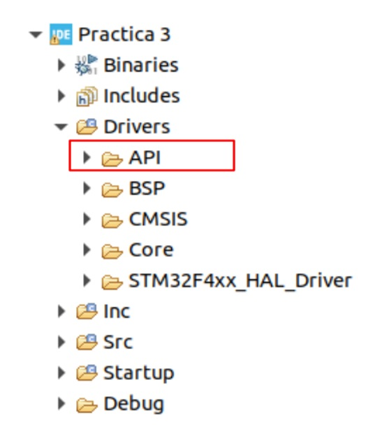
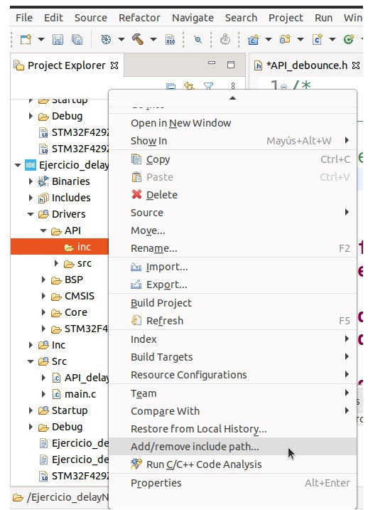

# Práctica 3

## Objetivo
Implementar un módulo de software para trabajar con retardos no bloqueantes a partir de las funciones creadas en la práctica 2.

## Punto 1
- Crear un nuevo proyecto como copia del proyecto realizado para la práctica 2.
- Crear una carpeta API dentro de la carpeta Drivers en la estructura de directorios del nuevo proyecto.
- Crear dentro de la carpeta API, subcarpetas /Src y /Inc.



Encapsular las funciones necesarias para usar retardos no bloqueantes en un archivo fuente `API_delay.c` con su correspondiente archivo de cabecera `API_delay.h`, y ubicar estos archivos en la carpeta API creada. En `API_delay.h` se deben ubicar los prototipos de las funciones y declaraciones.

```c
#include <stdint.h>  // Se debe incluir esta biblioteca para que compile correctamente
#include <stdbool.h> // Se debe incluir esta biblioteca para que compile correctamente

typedef uint32_t tick_t;
typedef bool bool_t;
typedef struct{
   tick_t startTime;
   tick_t duration;
   bool_t running;
} delay_t;

void delayInit(delay_t *delay, tick_t duration);
bool_t delayRead(delay_t *delay);
void delayWrite(delay_t *delay, tick_t duration);

``` 
En `API_delay.c` se deben ubicar la implementación de todas las funciones.

**Nota:** Cuando se agregan carpetas a un proyecto de Eclipse, se deben incluir en el "include path" para que se incluya su contenido en la compilación. Para ello, haz clic derecho sobre la carpeta con los archivos de encabezado y selecciona la opción "add/remove include path".



## Punto 2

Implementar un programa que utilice retardos no bloqueantes y haga titilar en forma periódica el LED de la placa NUCLEO-F4 de acuerdo a una secuencia predeterminada como en la práctica 2. Cada LED debe permanecer encendido durante 200 ms.

**Para reflexionar después de resolver el ejercicio:**

- ¿Es suficientemente clara la consigna 2 o da lugar a implementaciones con distinto comportamiento? ¿Qué pasa con la separación temporal entre encendidos sucesivos, se hace uno a continuación del otro o se espera un tiempo entre encendidos?
- ¿Se pueden cambiar el tiempo de encendido del LED fácilmente en un solo lugar del código o está hardcodeado? ¿Hay números “mágicos” en el código?
- ¿Qué bibliotecas estándar se debieron agregar a `API_delay.h` para que el código compile? Si las funcionalidades de una API propia crecieran, ¿habría que pensar cuál sería el mejor lugar para incluir esas bibliotecas y algunos typedefs que se usan en el ejercicio?
- ¿Es adecuado el control de los parámetros pasados por el usuario que se hace en las funciones implementadas? ¿Se controla que sean valores válidos? ¿Se controla que estén dentro de los rangos correctos?

### Demo
___Implementacion de retardos no bloqueantes para encender tres LEDs en diferentes periodos de tiempo sin detener el programa principal:___

