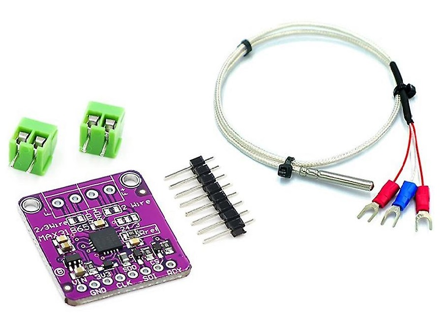

# __Trabajo Práctico Final__
## Sistema de adquisición de datos de temperatura

El proyecto consiste en un sistema de adquisición de datos de temperatura mediante el uso de un sensor PT100 y el integrado MAX31865. La información recopilada se transmite a través de UART a una aplicación de escritorio diseñada para la visualización y almacenamiento de los datos obtenidos en un archivo .xlsx para su posterior análisis.

## Diagrama de Bloques

## Módulo MAX31865
Max61865: Permite obtener mediciones de temperatura de los sensores PT100/PT1000 de 2, 3 o 4 hilos. Mediante el conversor delta-sigma integrado, este producto convierte la señal analógica a digital, con una resolución de 15 bits, generando así una resolución nominal de 0.03125ºC.

## Maquina De Estados Finitos

## Arquitectura De Software
